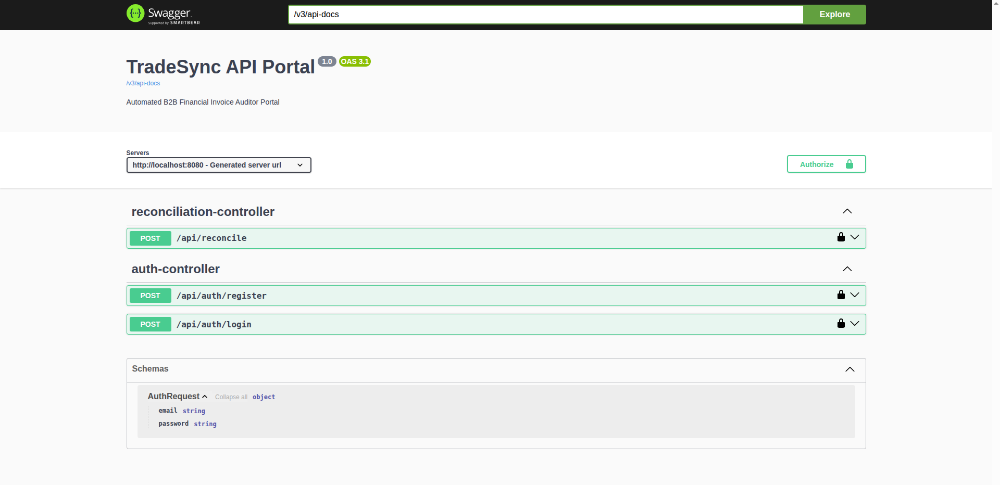
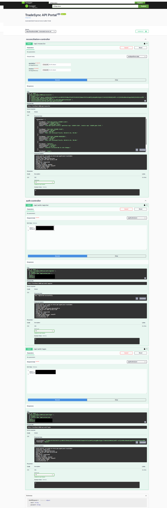

# TradeSync

TradeSync is a backend system built for large companies to match bills against original price quotes. It cuts out manual checking by catching pricing errors, quantity gaps, or extra line items automatically. You upload the documents, and the system runs the checks.

## API Reference

### User Authentication

You must log in before you can hit the reconciliation route.

```http
  POST /api/auth/register
  POST /api/auth/login
```

#### JSON Request Body

| Parameter | Type     | Description |
| :-------- | :------- | :---------- |
| `email`    | `string` | **Required**. Account email address |
| `password` | `string` | **Required**. Account password |

---

### Reconcile Documents

This endpoint runs the comparison script on your files.

```http
  POST /api/reconcile
```

#### Multipart Form Parameters

| Parameter   | Type     | Description |
| :---------- | :------- | :---------- |
| `quotation` | `string` | **Required**. Path or binary content of your quote PDF |
| `Invoice`   | `string` | **Required**. Path or binary content of your invoice PDF |

*Note: You must log in first, or the server blocks access to the reconcile endpoint. See the Swagger setup details in the screenshots.*

## Environment Variables

To get this backend running on your machine, add these lines to your `application.properties` file:

```properties
# Database connection string
spring.datasource.url=jdbc:mysql://localhost:3306/abhishek_tradesync?createDatabaseIfNotExist=true       
spring.datasource.password=your_mysql_password

# DeepSeek engine access
spring.ai.deepseek.api-key=your_deepseek_key
```

*Tip: Swap out `abhishek_tradesync` in the connection string if you want to use a different database name.*

## Future Steps

* Support batch file processing to handle massive folders of documents at once
* Build a simple front-end browser interface
* Add compatibility for other procurement files that often stall billing pipelines
* Expand support to Excel sheets, Word files, and image snapshots of quotes or invoices


## Screenshots





## License

[GNU GPLv3](https://choosealicense.com/licenses/gpl-3.0/)
